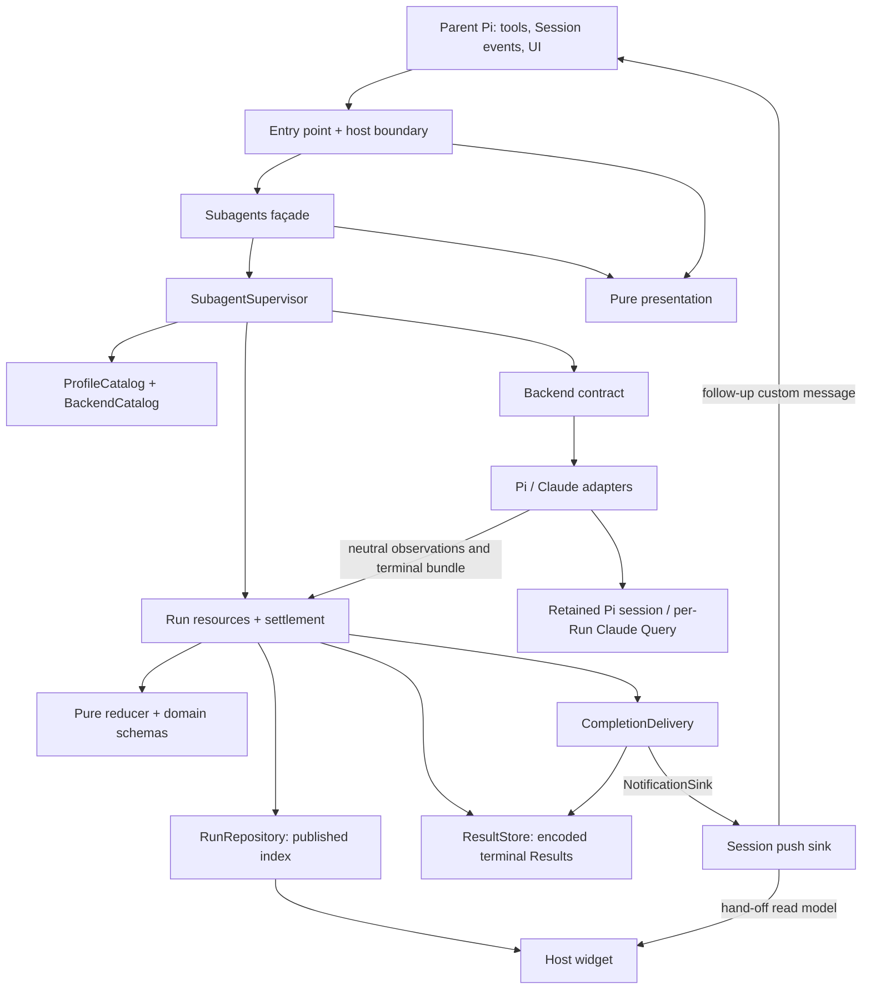

# Architecture

This is a source-navigation guide to the implementation shipped by
[package.json](../package.json), not a proposal or an account of removed 1.x code.
[CONTEXT.md](../CONTEXT.md) supplies vocabulary; [ADRs](adr/) explain decisions.
Read historical ADR bodies together with their amendments and current code.

## System shape

The extension delegates work from a parent Pi Session to named Profiles.
Start creates a stable Subagent and its first Run; resume creates another Run
on its retained Conversation. Each Subagent permits one active Run. Runs execute
asynchronously, producing immutable Results. They outlive the initiating turn,
not normal Session shutdown. Sources: [façade](../extensions/subagent/application/subagents.ts),
[supervisor](../extensions/subagent/runtime/supervisor.ts).



Arrows show calls/data flow, not import permission: the host implements the
runtime-defined `NotificationSink`, without a runtime-to-host import.
[Production composition](../extensions/subagent/host/production-backends.ts)
selects Pi and Claude with no built-in Profiles; demo and Pi-only sets serve
tests/live lanes, not alternative production modes.

## Modules and dependency rules

| Module | Responsibility and boundary |
| --- | --- |
| [`index.ts`](../extensions/subagent/index.ts) | Process-level registration; builds the production backend set through the composition entry and forwards host events. Registers nothing inside a child. |
| [`host/`](../extensions/subagent/host/) | Pi callbacks, tool decoding, runtime binding, notification transport and UI subscriptions. Tools call the façade; Session wiring and the widget also reach runtime services. |
| [`application/`](../extensions/subagent/application/subagents.ts) | Seven stateless functions: `start`, `resume`, `steer`, `cancel`, `wait`, `waitAll`, `result`. Maps inputs to requests and outcomes to presentation; cannot import Pi or a backend. |
| [`runtime/`](../extensions/subagent/runtime/) | Admission, resource lifetimes, settlement, index publication, storage and delivery. Knows the backend contract, not either adapter, the host, application or presentation. |
| [`domain/`](../extensions/subagent/domain/) | Schemas, transitions, bounded projections, reconciliation, usage, Results and Notifications. Pure functions; no runtime lifetimes or provider SDKs. |
| [`backend/contract.ts`](../extensions/subagent/backend/contract.ts) | Effect-typed, provider-neutral resource and execution contract. Shared backend helpers live alongside it. |
| [`backend/pi/`](../extensions/subagent/backend/pi/) and [`backend/claude/`](../extensions/subagent/backend/claude/) | Native construction, options, translation, execution and retained Conversation state. Neither adapter imports the runtime, host, presentation or the other adapter. |
| [`profiles/`](../extensions/subagent/profiles/discovery.ts) | Filesystem discovery; delegates parsing to the domain and validation to a supplied callback. |
| [`presentation/`](../extensions/subagent/presentation/) | Outcome prose, RunCards, rows and renderers. Depends on domain values and Pi display utilities, not Effect or runtime services. |
| [`testing/`](../extensions/subagent/testing/) | Scripted backends, native stand-ins, Session/host rigs and shared conformance scenarios. Not production orchestration. |

[`boundaries.test.ts`](../extensions/subagent/boundaries.test.ts) checks these
constraints with negative fixtures. Only named composition roots and permitted
tests reach concrete adapters. Pi session symbols are confined by imported
binding (its package also exports the host API); Claude by SDK package specifier.

`ManagedRuntime` and Effect execution at the outer boundary belong to `host/`
and the entry point, not adapters or core services. Cancellation crosses the
backend contract as Effect interruption, never a signal object. The Claude
adapter alone has an exception for native `AbortController`/`AbortSignal` use.
Domain code may import only `Schema` from Effect, not its runtime primitives.
See [ADR-0028](adr/0028-v2-backend-contract.md) and
[ADR-0029](adr/0029-v2-effect-schema.md).

## Composition and ownership

[`sessionRuntimeLayer`](../extensions/subagent/runtime/composition.ts) composes six
Session-long services: `BackendCatalog`, `ProfileCatalog`, `RunRepository`,
`ResultStore`, `CompletionDelivery`, `SubagentSupervisor`. Profiles validate through
backends; delivery receives the store; the supervisor receives all five.
Policy is a plain value; the clock is ambient unless injected for tests.
Shorter-lived resources are never Layers.

Resource scopes and fiber hosting are related but distinct:

```text
Session Scope
├── widget subscription / UI finalizers
├── Shutdown finalizer (registered after Work; runs before Work closes)
└── Work scope
    ├── Subagent Scope [one BackendAgent; retained while idle]
    │   └── Run Scope [one active Run's resources]
    │       ├── intake, mailbox, reducer bookkeeping
    │       └── native execution scope [native resource finalizers]
    └── hosted fibers: Run settlement, delivery, optional timeout

Native execution fiber: detached; supplied the native execution scope.
Run Scope registers a non-awaiting interruption request for that fiber.
```

The Run handle holds activation, settlement, projection, execution and stop-request
mechanisms plus a completion `Deferred`: a barrier, not the Result itself.
The reducer fiber is Run-scoped. Native execution is not structurally joined at
close, so escalation can abandon it; ordinary resources release in the nested scope.
Sources: [run-scope.ts](../extensions/subagent/runtime/run-scope.ts),
[supervisor.ts](../extensions/subagent/runtime/supervisor.ts),
[ADR-0023 amendment](adr/0023-v2-scope-ownership.md#amendment--2026-09-06).

The supervisor delegates three mechanisms rather than owning their state:
[admission](../extensions/subagent/runtime/admission.ts) owns capacity, Subagent
claims and Result reservations; [records](../extensions/subagent/runtime/subagent-records.ts)
own fixed facts, phase, attached Run and Conversation loss; [waiters](../extensions/subagent/runtime/waiters.ts)
own registrations and their shared pin. Records index Run owners but retain no fiber.
Failed admission releases its scoped lease; successful forking transfers release
to the Run fiber's finalizers, after detachment. [ADR-0034](adr/0034-supervisor-mechanisms-admission-lease-and-subagent-records.md).

## Session, start and resume

1. [`index.ts`](../extensions/subagent/index.ts) registers seven tools, one
   `/subagent` command and a notification renderer once per installation.
   Registrations close over a Session handle, not a particular runtime.
2. On `session_start`, [Session wiring](../extensions/subagent/host/session.ts)
   releases the previous binding, builds fresh services/backends, installs the
   widget in the runtime scope, binds the push sink, and refreshes Profile
   guidelines and diagnostics. The [handle](../extensions/subagent/host/session-handle.ts)
   returns a supplied not-ready answer when no runtime is bound.
3. [`host/tools.ts`](../extensions/subagent/host/tools.ts) decodes tool input.
   Start reads cwd, Pi's trust decision, current parent model/thinking, and
   child depth at call time. It deliberately does not connect the parent
   turn's abort signal to the new Run.
4. The façade collapses `description` into a one-line label, bounds it to
   200 UTF-8 bytes, and records shortening as an admission diagnostic.
   An empty resulting label is refused before reaching the supervisor.
   [ADR-0033](adr/0033-notification-vocabulary-pointer-and-label-bound.md).
5. The supervisor rejects shutdown, unknown/invalid Profiles and excessive
   depth, then atomically claims capacity. It allocates local identities and
   reserves the maximum Result size before opening a BackendAgent under the
   open budget. Failed open closes its scope and releases the lease; there is
   no public Run, Result or Notification, but allocated ids remain spent.
6. It prepares and attaches a complete Run handle before publishing the active
   row, forks settlement into Work, transfers the lease and opens activation.
   Only then does start return the Subagent and Run ids. A synchronous throw
   while preparing start's execution is also `backend unavailable`.

Resume checks the retained Subagent and synchronous `admitResume`, claims its
one-active-Run slot, reserves a Result and publishes a Run without reopening.
Active Subagents reject rather than queue; Profile, cwd, depth and resolved policy
stay fixed. Known Conversation loss refuses without a Run; post-admission failures
belong to the new Run. Sources: [supervisor](../extensions/subagent/runtime/supervisor.ts),
[ADR-0030](adr/0030-v2-backend-open-failure.md).

[`RunRepository`](../extensions/subagent/runtime/repository.ts) mints
`subagent-<nonce>-<n>` and `run-<nonce>-<n>`: independent sequences, one four-character
Session nonce, never provider identity. This reduces stale-transcript aliasing without guaranteeing uniqueness. [ADR-0031](adr/0031-v2-session-scoped-identifiers.md).

## Execution and settlement

Adapters emit ordered neutral observations into a bounded [intake](../extensions/subagent/runtime/observation-intake.ts).
Exact-key decoding rejects extra fields, including nested ones; malformed values
become redacted diagnostics. Full intake backpressures the producer. Pi's synchronous
callback cannot wait: its [bridge](../extensions/subagent/backend/pi/bridge.ts)
buffers and fails visibly on overflow rather than silently dropping evidence.
[ADR-0024](adr/0024-v2-observation-ordering.md).

One reducer fiber applies [`reduceRun`](../extensions/subagent/domain/reduce-run.ts)
and publishes lightweight repository snapshots, not full transcripts.
Activity is latest-value display state; terminal reduction clears it.
Tool results retain their own role; only assistant text supplies final output.
Usage deltas add, context gauges replace, and terminal reconciliation replaces
present fields without double charging. Missing fields retain streamed values.
See [reconciliation](../extensions/subagent/domain/reconcile-run.ts) and
[ADR-0027](adr/0027-v2-usage-normalization.md).

The current normal settlement order in
[`runToSettlement`](../extensions/subagent/runtime/run-scope.ts) is:

1. Await native execution exit, or bound its exit after cancellation.
2. Capture a terminal candidate; seal intake and close the Control mailbox.
3. Publish `finalizing`; close native execution resources under the cleanup
   budget; drain all accepted observations through the reducer.
4. Arbitrate, apply any terminal reconciliation and the ending, and construct
   the Result. Close the remaining Run Scope before storage.
5. Commit the bounded encoded Result, then publish terminal status and release
   the publication pin. Wake completion waiters, then initiate delivery.
6. Exit the Run fiber: detach the handle, leave an open Subagent idle, and
   release its admission lease. A closed Subagent cannot become idle again.

An in-stream ending can capture earlier, but cannot publish terminality or skip
waiting for execution. [Arbitration](../extensions/subagent/runtime/arbitration.ts)
prefers a reduced ending; a bundle beats later cancellation; interruption uses
the first recorded reason; defects fail with redacted diagnostics. Duplicates
are counted, not overwritten. The settlement guard preserves committed Results;
pre-commit faults attempt a failed fallback, then output-gone metadata if encoding
still fails. [ADR-0025](adr/0025-v2-terminal-settlement.md).

Cancel records `requested`, `shutdown` or `timeout`, closes the mailbox and
requests interruption without awaiting the provider; settlement continues.
Execution/cleanup overrun triggers counted escalation, bounded BackendAgent close
and Conversation loss; partial output can settle. Abandoned fibers or finalizers
may outlive this boundary: terminality after escalation does not prove external
side effects stopped. [Supervisor cleanup](../extensions/subagent/runtime/supervisor.ts).

## Backend contract: Pi and Claude

[`Backend`](../extensions/subagent/backend/contract.ts) validates Profiles and opens
a scoped BackendAgent with typed, redacted failure. BackendAgents declare capabilities,
admit resume without provider I/O, execute sequential Runs and close idempotently.
`execute(input, {emit, controls})` returns an ending and optional reconciliation,
not settlement; it has no typed error channel. Close may overlap execution.
[ADR-0028](adr/0028-v2-backend-contract.md).

| Concern | Pi | Claude |
| --- | --- | --- |
| Retained resource | Eagerly constructed in-process SDK session; memory-only session storage | Local BackendAgent initially has no provider identity; first Run acquires it |
| Per-Run work | Fresh subscription and baseline; prompt on retained session | Fresh streaming Query and client-owned async input stream |
| Resume | Another prompt on the same session | New Query with retained identity; no transcript replay by core |
| Capabilities | Resume, steering, terminal transcript snapshot | Resume and steering; no terminal transcript snapshot |
| Accounting | Per-message deltas; baseline excludes earlier Runs from terminal snapshot | Per-Query cumulative counters differenced at result boundaries, including auxiliary-model spend |
| Terminal evidence | Current Run's native message snapshot | Streamed transcript; reconciliation supplies turns and primary model only |
| Native cancellation | Queue clearing, abort and idle wait in scoped cleanup | Run-owned controller, Query close and input-stream closure |

Sources: Pi [agent](../extensions/subagent/backend/pi/agent.ts) /
[execution](../extensions/subagent/backend/pi/execution.ts); Claude
[agent](../extensions/subagent/backend/claude/agent.ts) /
[execution](../extensions/subagent/backend/claude/execution.ts) /
[accounting](../extensions/subagent/backend/claude/translate.ts).
Decisions: [ADR-0017](adr/0017-retained-pi-sdk-conversation.md), [ADR-0018](adr/0018-ordered-claude-query-conversation.md).

Claude drops replay/pre-attachment history, validates identity and never silently
falls back to a fresh Conversation. One Control is provider-visible at a time;
confirmation requires correlation. A result can end a Turn, not the Run, while
guidance remains outstanding; silence then has a 30-second bound, not a general
deadline. Both adapters separate local acceptance from transcript truth.
[ADR-0026](adr/0026-v2-control-admission.md).

## Results, waits and completion hand-off

[`ResultStore`](../extensions/subagent/runtime/result-store.ts) holds schema-encoded
JSON in Session memory, not disk; reads decode it. Idempotent commit preserves the
first Result on conflict. Reservations evict oldest unpinned output if needed;
retained metadata answers `ResultExpired`, not unknown. [ADR-0032](adr/0032-reservations-evict-rather-than-refuse.md).

Three pins protect a committed Result: publication until terminal publication,
waiters until all registered readers release, and delivery until its attempt
finishes. Reads do not mutate or consume storage. The
[waiter ledger](../extensions/subagent/runtime/waiters.ts) registers before lookup
and releases through finalization, so aborting one waiter affects only it.
`agent_wait` delivers stored Results using the same presentation as
`agent_result`; `agent_wait_all` snapshots active Run ids, then uses the same
collection path. Already-terminal Runs are excluded from that snapshot.

[Handlers](../extensions/subagent/host/tools.ts) hold notices before waiting and
mark returned Results consumed before release. Those notices are dropped; others
send when no covering hold remains. The all-wait holds the Session while the façade
reads ids. Abort races only the waiter, returning an immediate collection without
cancelling children. [ADR-0036](adr/0036-a-wait-delivers-the-result-it-waited-for.md).

[`CompletionDelivery`](../extensions/subagent/runtime/delivery.ts) claims Run ids,
reads Results, retries and sweeps for missed work. Success is **handed off**,
including held/suppressed notices. It reports exhaustion or unreadable Results
to the sink, never deciding landing or consumption itself.

The [Session push sink](../extensions/subagent/host/push-sink.ts) sends follow-ups
with `triggerTurn: true`. The entry forwards `message_start` to observe landing,
`turn_end` to record abort evidence or redispatch losses after a clean turn,
and `agent_settled` to retry losses only when Pi reports no pending messages.
A lost notice is redispatched once per loss. Consumption suppresses future
sending, but cannot remove a notice already queued in Pi.
The [widget](../extensions/subagent/host/widget.ts) sees only `pending`, `resolved`,
`exhausted`, `unannounceable`: terminal rows leave on landing or consumption,
not merely settlement. [ADR-0035](adr/0035-completion-hand-off-resolves-on-landing-or-consumption.md).

[Notifications](../extensions/subagent/domain/notification.ts) carry label, identities,
status, accounting and availability: `complete`, `partial`, `record-only`, derived
from output/transcript evidence and status. Nonblank output up to 16 KiB travels
whole (`output` present); longer output gets a 500-byte preview. Every notice
names the exact `agent_result` call; inlined ones say no fetch is needed.
Storage stays authoritative. [ADR-0037](adr/0037-a-notice-carries-a-short-output-whole.md).

## Profiles, trust, depth and bounds

[Discovery](../extensions/subagent/profiles/discovery.ts) reads only Markdown
Profiles under `getAgentDir()/agents`, not checkout-controlled Profiles.
Generic parsing owns `description`, `backend` (default `pi`) and prompt body;
backends validate other fields and diagnose unknown ones.
[ADR-0022](adr/0022-v2-terminology-and-backend-field.md).
[Pi model selection](../extensions/subagent/backend/pi/profile.ts) can inherit
the parent model and, when no model is pinned, its thinking level.
[Claude selection](../extensions/subagent/backend/claude/profile.ts) accepts its
listed family aliases and leaves omitted settings to the SDK, not the Pi parent.

Trust is Pi's `isProjectTrusted()` answer, fixed in Subagent context, not a new
extension trust calculation. [Pi options](../extensions/subagent/backend/pi/options.ts)
apply it to settings and resource loading. [Claude options](../extensions/subagent/backend/claude/options.ts)
do not consult it: permissions are bypassed, the environment is inherited,
and `settingSources`/`mcpServers` are omitted deliberately. Ambient MCP servers
and connectors therefore widen capability beyond the Profile's built-in tool
selection. This is not a sandbox. [ADR-0008](adr/0008-claude-children-inherit-operator-environment.md).

Delegation is one level deep. Admission checks the proposed child depth; entry
registration is inert above zero. Pi also filters this package's extensions,
uses a child-load discriminator during discovery, denies all seven delegation
tools and adds `PI_SUBAGENT_DEPTH` per Bash spawn. Claude denies `Agent`/`Task`
and adds the same depth key to its inherited subprocess environment.
Sources: [Pi options](../extensions/subagent/backend/pi/options.ts),
[child-load guard](../extensions/subagent/backend/pi/child-load.ts),
[Claude options](../extensions/subagent/backend/claude/options.ts).

[Runtime defaults](../extensions/subagent/runtime/policy.ts): 8 active Runs;
Controls bounded at 16 pending, 16 KiB each, 64 KiB pending total; observation
queue 256; encoded Result 256 KiB; store 4 MiB; open budget 30 seconds;
cleanup budget 5 seconds; delivery 3 attempts separated by 1 second.
There is **no default execution timeout**. An optional policy timeout uses the
ordinary cancellation path. [Projection bounds](../extensions/subagent/domain/projection.ts)
cap transcript/tools/diagnostics/links at 500/200/50/20, text parts at 16 KiB
and final output at 64 KiB; truncation is recorded. These bounds do not cap all
Session memory: idle BackendAgents, index/history metadata and provider context
remain retained until shutdown.

## Shutdown and verification navigation

On `session_shutdown`, [the handle](../extensions/subagent/host/session-handle.ts)
clears its live binding, unbinds the sink and disposes the managed runtime.
The supervisor's first shutdown caller closes admission, then closes Subagents
concurrently: mark closed, cancel active work with reason `shutdown`, await its
completion barrier, and bound Subagent-scope closure. It then stops delivery,
clears Results/records and forgets identities. Work's structural closure follows.
The sink drops unlanded notices and holds rather than forwarding them to the
next Session. Scope-owned widget subscriptions and UI resources are released.
[Shutdown implementation](../extensions/subagent/runtime/supervisor.ts).

Tests are colocated. [Conformance](../extensions/subagent/testing/conformance.ts)
runs one observable contract against resumable/one-shot fakes and Pi/Claude stand-ins,
with capability-aware skips and post-close leak assertions. Runtime and native
probes distinguish ownership; [`/subagent diagnostics`](../extensions/subagent/host/subagent-command.ts)
reports both plus hand-off counts, not provider continuation identities.

| Investigating | Start here |
| --- | --- |
| Lifecycle races/leaks | [races](../extensions/subagent/runtime/races.test.ts), [faults](../extensions/subagent/runtime/faults.test.ts), [backpressure](../extensions/subagent/runtime/backpressure.test.ts), [stress](../extensions/subagent/runtime/stress.test.ts) |
| Parent-visible behavior | [host end-to-end](../extensions/subagent/host/end-to-end.test.ts), [tools](../extensions/subagent/host/tools.test.ts), [push sink](../extensions/subagent/host/push-sink.test.ts) |
| Output changes | [RunCard](../extensions/subagent/presentation/run-card.ts), [result body](../extensions/subagent/presentation/result-body.ts), [notification text](../extensions/subagent/presentation/notification-text.ts) |
| Architecture changes | [boundaries](../extensions/subagent/boundaries.test.ts), [contract shape](../extensions/subagent/backend/contract.test.ts) |

[Commands](../package.json): `npm run typecheck`, `npm test`, `npm run test:conformance`;
`npm run check` adds lint. For one file, run on one shell line:
`node --import tsx --import ./extensions/subagent/suite-setup.ts --test <path.test.ts>`.
Authenticated SDK/host smoke lanes live in [scripts/](../scripts/) and run after
checks in `npm run release:check`. Stand-ins prove local contracts, not provider
availability or ambient connector behavior.
