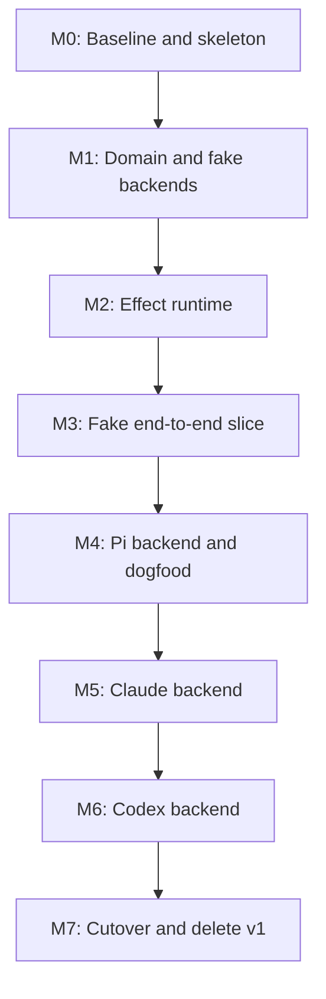

# pi-subagent v2 roadmap

**Status: the programme is delivered and the gate is not closed.** Every
milestone's deliverables have landed, M0 through M7, and the repository carries
one implementation: `extensions/subagent/`, published by the manifest, version
`2.0.0-rc.2`. Eleven of the definition of done's thirteen items pass. Three
things are outstanding and none of them is code:

1. **The six live gates have not been run on the cutover build.** All six
   passed at M6 and nothing since touched a backend adapter's behaviour, but
   the Codex runtime gate gained three proofs at M7 whose live half is
   unexercised.
2. **The Codex Desktop coexistence record does not exist for any CLI version**,
   so `npm run codex:retained-release:check` is red. It was red before M6 too.
   It is human-only and has no deterministic substitute. *Closed 2026-09-04:
   the record for codex-cli 0.153.0 exists and the check passes — item E3 of
   [the 2.0 close](release-close.md).*
3. **The release-candidate soak is open**, with an empty log — and because the
   deletion was taken before it rather than after, its rollback window is a
   release rollback rather than a Session-level switch.

One item is **not met** rather than outstanding: the definition of done's last
clause asked for less lifecycle machinery than v1, and the codebase is larger
by every count that can be constructed honestly. The measurement, and what is
true instead, are in [the deletion ledger](deletion-ledger.md).

[The M7 exit gate](m7-exit-gate.md) verifies every item one at a time and is
the record. **The plan that closes the three outstanding items is
[the 2.0 close](release-close.md)**, written 2026-09-04 after the
simplification programme's Phase C was planned; it also says why the soak's
log has stayed empty and what changes that. **This roadmap is now history**: the plan it describes was
followed, and the documents that describe the product are
[the architecture note](../architecture.md), [the glossary](../../CONTEXT.md),
[the compatibility matrix](compatibility-matrix.md), and
[the contributor rules](../contributing.md).

Milestone documents written before M7 name `extensions/subagent-v2/`, which is
now `extensions/subagent/`; their links were repointed, their prose was not,
because each describes the tree as it stood.


**Strategy:** Rewrite the execution architecture inside the existing `pi-subagent` product  
**Delivery model:** Gate-driven milestones, not a date-driven big-bang rewrite

## 1. Objective

Build a clean Effect-based v2 of `pi-subagent` while preserving the product behavior and provider knowledge already proven by v1.

The target product is:

> A thin Pi-native control and presentation layer for retained native coding agents. Pi, Claude, and Codex keep their own models, tools, configuration, continuation, and conversation semantics. A small Effect supervisor owns Subagent and Run lifetimes, normalizes backend observations into one bounded read model, and delivers progress and immutable results through a central UI.

The rewrite succeeds when:

- Pi, Claude, and Codex pass one shared backend conformance suite.
- The public Pi UX remains compatible: start, resume, steer, cancel, wait, result, existing Subagent-close behavior, notifications, and `/agents`.
- Session, Subagent, BackendAgent, and Run cleanup are scope-owned and deterministic.
- Backends emit normalized observations; only the core reducer mutates Run projections.
- Results are immutable, bounded, and available only after native cleanup and ordered observation reduction finish.
- Claude and Codex can be added after Pi without changing the generic Run lifecycle.
- v1 is deleted after v2 reaches full parity; the repository does not carry two products indefinitely.

## 2. Decisions already made

| Area              | Decision                                                                                                                              |
| ----------------- | ------------------------------------------------------------------------------------------------------------------------------------- |
| Product           | Keep `pi-subagent`; replace its internals rather than create a separate long-lived product.                                           |
| Development path  | Build v2 beside v1 in the same repository, then cut over and delete v1.                                                               |
| Vocabulary        | `backend` identifies Pi, Claude, or Codex; `adapter` is the integration boundary. Reserve `AgentHarness` for Pi's native abstraction. |
| Runtime           | Use Effect from the first runtime primitive. Domain models and reducers remain plain TypeScript.                                      |
| Ownership         | Session Scope → Subagent Scope → Run Scope.                                                                                           |
| State flow        | Backend observations → ordered reducer → `RunRepository` → presentation.                                                              |
| Completion        | Native ending + finalizers + reconciliation + ordered reduction → immutable stored result.                                            |
| Controls          | Bounded per-Run mailbox; local acceptance does not imply provider confirmation.                                                       |
| Capacity          | Reject immediately when at capacity. Do not invisibly queue Runs.                                                                     |
| Migration         | Baseline and backend API spikes, fake vertical slice, Pi dogfood, Claude, Codex, final cutover.                                       |
| Dependency policy | Pin the selected Effect v4 version exactly; avoid unstable packages initially.                                                        |

Vocabulary is deliberately narrow:

- `SubagentId` identifies the stable logical specialist exposed by the product.
- `BackendAgent` is the adapter-owned native conversation/session/process retained inside one Subagent Scope.
- `RunId` identifies one public `start` or `resume` operation.
- “Attempt” is adapter-internal vocabulary for native execution details and retries; it is not a core product type.

## 3. Architectural invariants

These are acceptance rules, not aspirations.

1. A Subagent is a stable logical specialist; a Run is one unit of work.
   Every admitted public `start` or `resume` operation creates a new Run; `resume` continues the Subagent's retained native conversation rather than restarting an old Run. Unsupported or rejected operations allocate no public Run.
2. One Subagent owns at most one active Run.
3. A `BackendAgent` owns retained native conversation resources.
4. A backend Run invokes one adapter execution from the core's perspective; provider attempts, retries, and subrequests remain adapter-internal.
5. Provider wire objects never cross the adapter boundary.
6. Backends never mutate central Run state directly.
7. Semantic observations are ordered and lossless within a Run.
8. Activity is conflated: latest value wins.
9. Usage crossing the boundary is Run-local; context occupancy is a gauge.
10. Terminal reconciliation may heal streamed projection drift without double-counting usage.
11. A Run settles exactly once.
12. A result cannot become ready before Run-scope finalizers finish.
13. Late native events cannot mutate a terminal Run.
14. Notification failure cannot change or lose a stored result.
15. Closing the Pi Session Scope releases all Subagent, BackendAgent, and Run resources beneath it.
16. `Effect.runPromise` is allowed only at the Pi host boundary and necessary native callback bridges.
17. Layers are for session-long services, not Subagents, BackendAgents, Runs, Queries, turns, or subscriptions.
18. All queues, projections, transcripts, diagnostics, and result storage have explicit bounds.
19. Once shutdown begins, new starts, resumes, and controls are rejected; shutdown is idempotent.
20. Aborting a caller waiting in `agent_wait` stops only that waiter, not the underlying Run.

## 4. Delivery sequence



| Milestone | Primary outcome                                    | Gate                                                             |
| --------- | -------------------------------------------------- | ---------------------------------------------------------------- |
| M0 ✅     | v1 behavior is captured; v2 compiles independently | Baseline CI and compatibility matrix are green — **passed**, see [the M0 exit gate](m0-exit-gate.md) |
| M1 ✅     | Plain domain kernel and two fake backends          | Lifecycle behavior is demonstrable without a provider SDK — **passed**, see [the M1 exit gate](m1-exit-gate.md) |
| M2 ✅     | Scoped Effect supervisor and central projection    | All lifecycle and race tests pass against fakes — **passed**, see [the M2 exit gate](m2-exit-gate.md) |
| M3 ✅     | Complete fake-backed product vertical slice        | Actual host handlers, UI, delivery, and shutdown work end to end — **passed**, see [the M3 exit gate](m3-exit-gate.md) |
| M4 ⏳     | Native Pi backend and product dogfood              | Pi passes conformance and v2 is usable as the daily driver — everything **passed** except the soak, see [the M4 exit gate](m4-exit-gate.md) and [the soak record](soak.md) |
| M5 ✅     | Claude adapter                                      | Claude fits without generic lifecycle changes — **passed**, see [the M5 exit gate](m5-exit-gate.md) |
| M6 ✅     | Codex adapter                                      | Codex fits without generic lifecycle changes — **passed**, both live gates included, see [the M6 exit gate](m6-exit-gate.md) |
| M7 ⏳     | v2 becomes the sole implementation                 | Deliverables complete; the soak and the two credentialed gates are outstanding — see [the M7 exit gate](m7-exit-gate.md) |

## 5. Milestone details

### M0 — Freeze, baseline, and v2 skeleton

**Status: complete (2026-09-02).** Every deliverable below landed; the
verification is recorded in [the M0 exit gate](m0-exit-gate.md), which links
every artifact.

**Purpose:** Turn v1 into an executable behavioral specification and create a clean construction site for v2.

Deliverables:

- Freeze v1 except for critical fixes and testability changes.
- Create the v2 tree beside v1, defaulting to `extensions/subagent/` until cutover.
- Give v2 an independent entry point, build target, test target, and CI lane.
- Add a session-level opt-in switch or alternate extension entry point. Do not switch implementation per Run.
- Run short, disposable API-risk spikes for Pi, Claude, and Codex covering native open, run, resume, steer, cancel, close, event bridging, and usage surfaces. Record findings; do not turn the spikes into production adapters.
- Write a public compatibility matrix covering:
  - `agent_start`
  - `agent_resume`
  - `agent_steer`
  - `agent_cancel`
  - `agent_wait`
  - `agent_result`
  - Subagent close through the existing host/session surface; do not introduce a new model tool unless v1 already exposes one
  - `/agents`
  - active widget
  - completion messages
  - profile loading and validation
- Inventory reusable v1 knowledge and classify it as:
  - pure and reusable;
  - provider-specific and portable into an adapter;
  - lifecycle machinery to rewrite;
  - obsolete and removable.
- Record architecture decisions for terminology, scope ownership, observation ordering, terminal settlement, control admission, and usage normalization.
- Decide how any existing public/profile `harness` field migrates to `backend`: preserve it as a deprecated boundary alias or make a documented configuration migration. Do not leak the old name into the v2 core. **Decided: a documented configuration migration with no alias** — [ADR-0022](../adr/0022-v2-terminology-and-backend-field.md), [migration note](profile-backend-field-migration.md). The old name is kept out of the v2 tree by a check in `extensions/subagent/boundaries.test.ts`.
- Specify public operation semantics before implementation:
  - failed start admission creates no public Run, never reuses allocated IDs, and releases every scope, capacity reservation, and retained native resource;
  - start/resume admission atomically enforces global capacity and one active Run per Subagent;
  - repeat cancellation is idempotent and distinguishes request admission from terminal cancellation;
  - closing a Subagent with an active Run uses one documented policy, preferably cancel-and-await-cleanup;
  - shutdown rejects new work as soon as shutdown starts;
  - aborting `agent_wait` does not cancel its Run;
  - a full control mailbox returns an immediate typed result rather than blocking;
  - requesting an evicted result returns a distinct typed outcome rather than `unknown run`.
- Select and pin one exact Effect v4 version after a small compatibility spike. **Pinned: `effect@4.0.0-rc.112`** — [spike findings](effect-compatibility-spike.md).
- Add dependency rules preventing v2 runtime code from importing v1 lifecycle code.

Recommended reuse candidates:

- Profile parsing and schema rules.
- Model and effort validation.
- Provider diagnostic confinement.
- Pure message translators.
- Generated Codex protocol types.
- Presentation formatting with no lifecycle state.
- Existing conformance scenarios and release smoke tests.

Rewrite rather than reuse:

- `SubagentManager` and `SubagentRuns` ownership.
- Dispatcher and runner orchestration.
- `ControlSource` lifecycle.
- Delivery orchestration.
- Provider Attempt cancellation and cleanup.
- Session shutdown machinery.

**Exit gate — all items passed. Verification: [M0 exit gate](m0-exit-gate.md).**

- ✅ v1 baseline tests are green. [Freeze policy and recorded baseline](freeze.md).
- ✅ The compatibility matrix has an explicit expected outcome for every command and backend capability. [Compatibility matrix](compatibility-matrix.md), with [public operation semantics](operation-semantics.md).
- ✅ All three backend spikes confirm that the proposed Subagent-scoped/Run-scoped ownership model is viable, or any exception is captured as an ADR before the core contract is implemented. [Pi](spikes/pi-backend-api-risk.md), [Claude](spikes/claude-backend-api-risk.md), [Codex](spikes/codex-backend-api-risk.md); exceptions carried into [ADR-0023](../adr/0023-v2-scope-ownership.md), [ADR-0024](../adr/0024-v2-observation-ordering.md), and [ADR-0027](../adr/0027-v2-usage-normalization.md).
- ✅ v2 builds and runs a placeholder extension without importing v1 runtime modules. `extensions/subagent/`, enforced by `extensions/subagent/boundaries.test.ts`.
- ✅ The selected Effect version is exact-pinned and the initial primitive set compiles. [Effect compatibility spike](effect-compatibility-spike.md).

**M0 artifacts:**

| Artifact | Where |
| --- | --- |
| Freeze policy and recorded baseline | [`freeze.md`](freeze.md) |
| Public compatibility matrix | [`compatibility-matrix.md`](compatibility-matrix.md) |
| Public operation semantics | [`operation-semantics.md`](operation-semantics.md) |
| Effect compatibility spike and pin | [`effect-compatibility-spike.md`](effect-compatibility-spike.md) |
| Pi backend API-risk spike | [`spikes/pi-backend-api-risk.md`](spikes/pi-backend-api-risk.md) |
| Claude backend API-risk spike | [`spikes/claude-backend-api-risk.md`](spikes/claude-backend-api-risk.md) |
| Codex backend API-risk spike | [`spikes/codex-backend-api-risk.md`](spikes/codex-backend-api-risk.md) |
| v1 knowledge inventory | [`v1-inventory.md`](v1-inventory.md) |
| Profile backend field migration | [`profile-backend-field-migration.md`](profile-backend-field-migration.md) |
| ADR — v2 terminology and the Profile backend field | [`../adr/0022-v2-terminology-and-backend-field.md`](../adr/0022-v2-terminology-and-backend-field.md) |
| ADR — v2 scope ownership | [`../adr/0023-v2-scope-ownership.md`](../adr/0023-v2-scope-ownership.md) |
| ADR — v2 observation ordering | [`../adr/0024-v2-observation-ordering.md`](../adr/0024-v2-observation-ordering.md) |
| ADR — v2 terminal settlement | [`../adr/0025-v2-terminal-settlement.md`](../adr/0025-v2-terminal-settlement.md) |
| ADR — v2 control admission | [`../adr/0026-v2-control-admission.md`](../adr/0026-v2-control-admission.md) |
| ADR — v2 usage normalization | [`../adr/0027-v2-usage-normalization.md`](../adr/0027-v2-usage-normalization.md) |
| ADR — v2 backend contract | [`../adr/0028-v2-backend-contract.md`](../adr/0028-v2-backend-contract.md) |
| ADR — v2 backend open failure | [`../adr/0030-v2-backend-open-failure.md`](../adr/0030-v2-backend-open-failure.md) |
| M4 exit gate | [`m4-exit-gate.md`](m4-exit-gate.md) |
| v2 Pi soak record | [`soak.md`](soak.md) |
| v2 glossary section | [`../../CONTEXT.md`](../../CONTEXT.md) |

### M1 — Domain kernel and fake backends

**Status: complete (2026-09-02).** Every deliverable below landed; the
verification is recorded in [the M1 exit gate](m1-exit-gate.md), which links
every artifact. The backend contract is
[ADR-0028](../adr/0028-v2-backend-contract.md).

**Purpose:** Define the product semantics before introducing provider SDK behavior.

Deliverables:

- Plain TypeScript domain types:
  - `BackendId`, `SubagentId`, `RunId`, and control IDs;
  - Subagent and Run phases, including explicit transition tables and an absorbing terminal Run state;
  - `RunObservation`;
  - `RunEnding` and `RunResult`;
  - `UsageDelta`, `ContextGauge`, and `UsageSnapshot`;
  - typed diagnostics and result links;
  - typed public outcomes and errors.
- A pure `reduceRun` function with bounded transcript/tool/diagnostic projections.
- Call-ID-based tool projection rules so transcript parts and tool-progress observations merge rather than duplicate one native tool call.
- A pure terminal reconciliation function with explicit field semantics: present fields authoritatively replace their projection, absent fields retain the streamed value, and unfinished tools are marked with the terminal outcome.
- Backend contracts for:
  - profile preparation;
  - opening and closing a retained `BackendAgent`;
  - running one backend execution;
  - declared capabilities;
  - steering/control delivery;
  - terminal ending and reconciliation.
- `FakeResumableBackend`.
- `FakeOneShotBackend`.
- Generators/fixtures for duplicate, delayed, reordered-at-boundary, and late observations.
- Unit and property-style tests for reducer invariants and usage reconciliation.

Required scenarios:

```text
start → progress → complete → result
start → steer → confirm/reject → complete
start → cancel → partial result
start → fail → diagnostic + partial result
complete → resume → new Run-local usage
shutdown → all retained resources close
```

**Exit gate:**

- Both fake backends pass the initial backend conformance suite.
- The reducer is deterministic and contains no Effect or provider SDK types.
- Transition-table tests cover every legal Subagent/Run state change; terminal Run states are absorbing.
- Replaying the same terminal reconciliation is idempotent.
- A previous conversation's usage cannot be charged to a resumed Run.
- Provider-native payloads cannot be represented in public domain types except as bounded, typed annotations or links.

### M2 — Effect supervisor and projection runtime

**Status: complete (2026-09-02).** Every deliverable below landed; the
verification is recorded in [the M2 exit gate](m2-exit-gate.md), which links
every artifact. The open failure channel is
[ADR-0030](../adr/0030-v2-backend-open-failure.md), and the Schema adoption was
gated by [the Effect Schema spike](spikes/effect-schema.md).

**Purpose:** Build the complete lifecycle once against deterministic fakes.

Deliverables:

- Session-long services:
  - `BackendCatalog`;
  - `ProfileCatalog`;
  - `RunRepository`;
  - `ResultStore`;
  - `SubagentSupervisor`;
  - `CompletionDelivery`.
- One managed Effect runtime per Pi session.
- Session, Subagent, Run, and nested native-execution scopes with scoped acquisition/finalization. The Run scope retains the reducer and settlement coordinator while the native-execution scope can close independently.
- One child Run fiber per active Run.
- One reducer fiber per Run.
- Ordered semantic-observation queue and a defined native callback bridge overflow policy. Semantic events are never silently dropped: a bridge that cannot backpressure must fail/cancel visibly or use a proven bounded handoff.
- Conflated activity state.
- Bounded control queue with explicit admission outcomes.
- Per-Run completion `Deferred` used only as a wake-up/synchronization signal; `ResultStore` remains the canonical value source for initial, late, and repeated `wait`/`result` calls.
- `SubscriptionRef`-based current Run index for UI consumers.
- Bounded event fan-out only where replay-free events are needed.
- Explicit runtime policy:
  - maximum active Runs;
  - immediate overflow rejection;
  - maximum pending controls;
  - projection item limit;
  - total result-store byte limit;
  - optional default timeout.
- Explicit lifecycle semantics for `finalizing`, so native execution may be done while cleanup and result commit remain in progress without falsely showing a terminal state.
- One settlement coordinator that makes this user-visible invariant true: if a snapshot is terminal, `agent_result` can immediately retrieve the same immutable result.
- Idempotent result commit by `RunId` and replay-safe completion delivery with `RunId` deduplication.
- A bounded cleanup/escalation policy for native finalizers. Every backend eligible for release must prove bounded termination, using adapter-specific forced termination where necessary; a hung SDK finalizer must not leave a Run permanently ambiguous.
- A result-retention policy that:
  - reserves enough capacity at Run admission to guarantee one bounded terminal result;
  - truncates oversized output and diagnostics deterministically and records the truncation;
  - evicts only eligible older results;
  - pins a new result through terminal publication, completion of waiters already registered at settlement, and either successful notification or exhaustion of its bounded delivery retry budget;
  - returns a typed `ResultExpired` outcome for a known evicted Run;
  - rejects new Run admission honestly when reservations plus pinned results leave insufficient guaranteed result capacity.
- Exactly-once settlement path:

```text
capture terminal bundle: candidate ending + optional reconciliation
→ seal semantic intake
→ close or escalate the nested native-execution scope
→ drain/reduce accepted observations
→ apply terminal reconciliation
→ produce the bounded candidate result
→ close the remaining Run scope
→ store immutable result idempotently
→ publish terminal snapshot
→ initiate completion delivery
```

- Effect Schema, per [ADR-0029](../adr/0029-v2-effect-schema.md):
  - a disposable spike answering its three questions before any of the below lands;
  - schema declarations in the domain beside the types they describe, replacing the hand-written validators, the phantom identifier brand and its guards, and the duplicated exact-key-set checks;
  - observations decoded as they cross the backend seam, so ADR-0024's no-provider-vocabulary rule is rejected at the seam rather than trusted;
  - `RunResult` encoded and decoded for `ResultStore` persistence;
  - the domain boundary rule tightened from "no package specifiers" to a named-import check that admits `Schema` alone and still forbids every runtime primitive, with fixtures.
  The M3 obligations — the Notification custom message, and replacing `typebox` for tool parameter schemas — are listed under M3.
- Deterministic supervisor race tests using controlled `Deferred`s and a test clock.

Required race tests:

- Complete versus cancel.
- Timeout versus complete.
- Shutdown versus start.
- Steering versus terminal settlement.
- Subagent close versus resume.
- Backend loss versus cancel.
- Result storage versus notification failure.
- Late callback versus Run-scope closure.
- Capacity admission versus concurrent completion.
- Late and repeated waiters versus settlement, waiter abort, timeout, and result eviction.
- Result-store pressure versus terminal publication and pending notification delivery.

**Exit gate:**

- The complete public lifecycle works against both fake backends.
- Every race ends with one terminal result and no stranded fiber, Queue, Deferred, or subscription.
- Closing the root session scope closes all active Runs, Subagents, and retained BackendAgents.
- Notification failures are retryable independently of settlement.
- Completion delivery can recover from a missed subscription notification by reading stored results.
- `Effect.runPromise` and `AbortController` do not appear in generic domain/runtime code.
- No Subagent, BackendAgent, or Run is represented as a Layer.

### M3 — Fake-backed host and presentation vertical slice

**Status: complete (2026-09-03).** Every deliverable below landed; the
verification is recorded in [the M3 exit gate](m3-exit-gate.md), which links
every artifact and records the three deliberate v2 differences. `Schema`
emitted tool parameter documents the Pi host accepts, so the `typebox` fallback
ADR-0029 reserved was not needed: the second schema library is now banned
anywhere in v2 by the boundary test, and the dependency stays in the manifest
only until v1 is deleted at M7.

**Purpose:** Prove the real product boundaries before provider lifecycle work begins.

Deliverables:

- `Subagents` application façade.
- Actual Pi host DTO mappings and handlers wired to fake backends, with tool input decoded at that boundary by `Schema` ([ADR-0029](../adr/0029-v2-effect-schema.md)). If `Schema.JsonSchema` cannot emit tool parameter schemas the Pi host accepts, `typebox` stays at that one call site and nowhere else — the fallback ADR-0029 records.
- The completion Notification custom message built and parsed from one `Schema` declaration, replacing v1's hand-written pair.
- All existing model-tool operations exercised end to end.
- `wait` backed only by `ResultStore`; aborting the host request affects only the waiter.
- `RunCard`, `/agents`, and a minimal active widget consuming only central projections.
- Completion delivery and a fake notification sink sourced from stored results.
- Session shutdown binding that disposes the managed runtime.
- Golden tests for tool outputs, status/error mapping, widget rows, results, and notifications.
- Backpressure/load tests for bursty observations, full control queues, high-frequency activity, and slow presentation subscribers.

**Exit gate:**

- Every public operation works through the actual host handlers with both fake backends.
- A terminal snapshot and its immutable result become visible atomically enough to satisfy immediate retrieval.
- Result storage always precedes notification; missed or failed delivery cannot lose the result.
- The presentation layer folds no backend events and owns no lifecycle state.
- Repeated fake sessions start and shut down without retained fibers, queues, subscriptions, or waiters.

### M4 — Pi backend adapter and dogfood

**Status: every deliverable landed and every exit-gate item passed except the
daily-driver soak (2026-09-03).** The verification is recorded in
[the M4 exit gate](m4-exit-gate.md), which enumerates and classifies every
change made outside the Pi adapter directory — the program-level signal
section 12 asks for. The backend contract needed none, so
[ADR-0028](../adr/0028-v2-backend-contract.md) is marked stable. The soak is
logged in [`soak.md`](soak.md) and is counted by representative usage rather
than by elapsed days.

**Purpose:** Prove the abstraction against the host-native backend and make v2 useful as a daily driver.

Deliverables:

- Pi profile preparation preserving model, tools, resources, and validation behavior.
- A retained Pi `BackendAgent` around the current native conversation abstraction.
- One scoped Pi attempt per Run.
- Native event subscription expressed as scoped acquisition/release.
- Translation from native Pi events/messages into `RunObservation`.
- Native steering consuming the bounded control mailbox serially.
- Native interruption tied to cancellation of the attempt child fiber; the supervisor Run fiber remains alive to perform cleanup, reconciliation, settlement, and result storage.
- Run-local usage translation and terminal reconciliation.
- Partial-output preservation on cancellation or failure where Pi exposes it.
- Idempotent BackendAgent close and protection against late native events.
- Live Pi smoke tests in a separate opt-in test lane.
- Full central UI and expanded result presentation with recent transcript, tools, usage, context, diagnostics, native links, and final output.
- Dogfood diagnostics for cleanup escalation, duplicate settlement attempts, queue overflow, reconciliation differences, late events, and delivery failures.

The Pi adapter must hide whether Pi internally uses `AgentSession`, `AgentHarness`, or a later abstraction.

**Exit gate:**

- Pi passes the shared Subagent/BackendAgent, Run, Control, Usage, and cleanup conformance suites.
- Start, resume, steer, cancel, timeout, and shutdown pass live smoke tests.
- A cleanup probe shows no retained native listener/session after Subagent or session closure.
- No Pi event or session type leaks into generic runtime or presentation modules.
- Use v2 with the Pi backend as the default local daily driver for an agreed soak window.
- Do not count the soak window by elapsed days alone; require representative start/resume/steer/cancel/shutdown usage.
- The Pi compatibility matrix is complete.
- No known severity-1 or severity-2 lifecycle defect remains.
- All state visible in the UI comes from `RunRepository`/`ResultStore`; the UI folds no provider events.
- v1 remains available only as a session-level fallback.
- The generic runtime contract is marked stable before Claude work begins.

### M5 — Claude backend adapter

**Purpose:** Validate retained continuation and streaming Query semantics without expanding the core into a provider runtime.

Deliverables:

- Claude profile/settings preparation.
- Retained conversation identity and Query factory owned by `BackendAgent`.
- Scoped Query lifecycle per Run.
- Streaming input and native tool behavior contained in the adapter.
- Message, tool, model, diagnostic, and result-link translation.
- Run-local usage deltas, cache usage, context gauge, and terminal reconciliation.
- Control correlation with honest submitted/confirmed/rejected stages.
- Cancellation, process/query loss, resume, and close behavior.
- Live Claude smoke and continuation tests.

**Architecture challenge gate:**

Any requested change outside `backend/claude/` must be classified as one of:

1. a missing provider-neutral product semantic, backed by fake-backend and conformance tests; or
2. provider-specific leakage, which must remain inside the adapter.

**Exit gate:**

- Claude passes all shared conformance suites and live gates.
- Resume does not charge prior conversation usage to the new Run.
- Provider replay does not create duplicate transcript items or usage.
- The generic Run lifecycle and result model require no Claude-specific branch.

**Result:** passed on 2026-09-03. Claude passes all 37 shared scenarios with
**no skips**, the two live gates pass, and the generic runtime, domain,
presentation, and façade are byte-identical to M4 — the backend contract
included. Three provider-neutral changes were made outside `backend/claude/`
and one shared conformance check was loosened; each is classified in
[the M5 exit gate](m5-exit-gate.md), section 11.

### M6 — Codex backend adapter

**Purpose:** Validate the seam against a retained process/thread and turn-based protocol.

Deliverables:

- Scoped App Server transport and process ownership.
- Retained thread/conversation owned by `BackendAgent`.
- One native turn per Run.
- Translation of turn, item, tool, usage, diagnostic, and transport-loss events.
- Native `turn/steer` mapping with truthful control stages.
- Background-terminal tracking and cleanup before settlement.
- Run-local usage normalization and terminal reconciliation.
- Process loss, cancellation, resume, BackendAgent close, and session shutdown behavior.
- Live Codex transport and lifecycle tests.

**Exit gate:**

- Codex passes all shared conformance suites and live gates.
- A result is unavailable until background terminals and Run finalizers are closed.
- Retained process/thread state never enters generic repositories.
- The generic Run lifecycle and result model require no Codex-specific branch.

**Result:** passed on 2026-09-03. Codex passes all 37 shared scenarios with
**no skips**, and the generic runtime, domain, presentation, the façade, and the
backend contract are byte-identical to M5 — no file under `runtime/`, `domain/`,
`presentation/`, or `application/` changed at all, and the shared conformance
suite was not touched. Three changes were made outside `backend/codex/` — the
composition root, one missing provider-neutral semantic in the shared Profile
field module, and a test helper — and each is classified in
[the M6 exit gate](m6-exit-gate.md), section 11. Both live gates were run and
passed: `npm run v2:codex:smoke` printed `V2_CODEX_LIVE_SMOKE_PASS` over 21
checks and `npm run v2:codex:host-smoke` printed
`V2_CODEX_HOST_LIVE_SMOKE_PASS`, against a `codex` CLI one release newer than
the pinned protocol snapshot — which is itself the evidence that an undeclared
protocol method is ignored rather than fatal.

### M7 — Cutover, hardening, and v1 deletion

**Purpose:** End the migration with one implementation and one mental model.

Deliverables:

- Run the complete compatibility matrix for Pi, Claude, and Codex.
- Run deterministic stress tests for repeated start/resume/cancel/shutdown cycles.
- Verify storage, projection, queue, diagnostic, and text bounds under load.
- Compare representative v1 and v2 presentation/results for behavioral regressions.
- Make v2 the default implementation.
- Complete a release-candidate soak across all three backends.
- Remove the fallback switch after the rollback window.
- Delete v1 runtime/lifecycle code and obsolete tests.
- Rename/move the v2 tree into the canonical `extensions/subagent/` location.
- Update user documentation, architecture notes, debugging guidance, and contributor rules.
- Record the final deletion ledger: which old abstractions and cleanup mechanisms no longer exist.

**Final release gate:**

- All three backends pass shared conformance and their live smoke gates.
- Public commands and user-visible outcomes satisfy the compatibility matrix.
- Session shutdown leaves no known native process, Query, listener, subscription, or fiber alive.
- Failure and cancellation preserve partial output when available.
- Completion delivery failure never affects result retrieval.
- No v1 production path or compatibility flag remains.
- The v2 architecture can be explained using Session Scope, Subagent Scope, Run Scope, BackendAgent, observations, reducer, repository, and immutable result—without referencing legacy managers or dispatchers.

## 6. Shared conformance program

Every backend must run the same suite; backend-specific live tests supplement it but do not replace it.

### Subagent and BackendAgent conformance

- Profile validation is deterministic.
- Opening a BackendAgent creates no public Run.
- Capabilities are declared and enforced.
- Only one Run is active per Subagent.
- A subsequent Run resumes or honestly reports unsupported/lost.
- Close is idempotent.
- Close releases every retained native resource.

### Run conformance

- Observations are reduced in accepted order.
- Competing completion, failure, cancellation, timeout, and transport-loss signals are arbitrated so exactly one ending wins.
- Cancellation eventually terminates the native backend execution.
- Result readiness follows finalizer completion.
- Late events cannot mutate a terminal Run.
- Reporter failure cannot strand the backend execution.
- Partial output survives failure/cancellation when available.
- Provider wire objects remain adapter-local.

### Control conformance

- Unsupported steering returns `unsupported`.
- Local admission is bounded.
- Accepted controls are delivered serially.
- Mailbox closure rejects new controls.
- Pending controls cannot leak into the next Run.
- Provider confirmation is never fabricated.

### Usage conformance

- Deltas are Run-local.
- Terminal reconciliation cannot double count.
- Context occupancy is a gauge.
- Provider replay does not count as new usage.
- Resume does not include previous conversation usage.

### Projection and delivery conformance

- Only the repository writes Run snapshots.
- Projection sizes remain within configured limits.
- Settlement stores the result exactly once.
- `wait` and `result` observe the same immutable value.
- Notifications occur after storage.
- Notification retry cannot duplicate or alter settlement.

### Test lanes

- **Every pull request:** pure reducer tests, shared conformance against controlled fakes, mocked adapter integrations, race tests, backpressure tests, fault injection, golden presentation tests, and import-boundary checks.
- **Nightly/release:** credentialed live smoke tests for Pi, Claude, and Codex with provider-specific diagnostics.
- **Dogfood:** representative real workflows and repeated session creation/shutdown, with leak counters and settlement diagnostics enabled.

Do not use sleep-based timing as proof of race correctness. Use controlled `Deferred`s, a test clock, test hooks, and explicit resource counters for fibers, queues, subscriptions, listeners, Queries, sessions, and child processes.

## 7. Migration and rollback policy

### Coexistence rules

- v1 and v2 may coexist only during the migration milestones.
- Select the implementation once per Pi session; never mix v1 and v2 ownership inside one Subagent or Run.
- v2 may reuse pure logic, fixtures, generated types, and tests from v1.
- v2 must not import v1 managers, dispatchers, control sources, resource owners, or Attempt orchestration.
- Fix a behavior in both versions only when it is release-critical; otherwise fix v2 and keep v1 frozen.

### Cutover order

1. Opt-in v2 with fake backends in CI.
2. Opt-in v2 with Pi live tests.
3. Pi v2 daily-driver default with session-level v1 fallback.
4. Claude v2 enabled after the runtime contract freezes.
5. Codex v2 enabled after Claude validates continuation semantics.
6. v2 default for all backends.
7. Release-candidate soak.
8. Remove fallback and delete v1.

### Rollback

- Before final deletion, rollback means starting a new Pi session on v1; no in-memory Subagent, BackendAgent, or Run migrates between implementations.
- After final deletion, rollback is a normal release rollback to the last known-good version, not a permanent dual architecture.
- A stored v2 result remains readable even when notification delivery fails; delivery incidents alone do not justify rerunning work.

### Immediate cutover blockers

Do not enable or continue a cutover if any of these is reproducible:

- one user request executes twice;
- a terminal snapshot appears before its result is retrievable or cleanup completes;
- a late observation mutates terminal state;
- shutdown leaks or hangs on a fiber, listener, Query, session, process, or background terminal;
- cancellation cannot terminate within the backend's declared cleanup policy;
- resume targets the wrong native conversation;
- an accepted semantic observation is silently lost or reordered;
- usage is materially double-counted;
- a public tool schema or profile contract breaks without the agreed migration.

## 8. Scope control

### Required for v2 cutover

- Existing public tool/command behavior.
- Retained BackendAgent and per-Run lifecycle.
- Start, resume, steer, cancel, wait, result, and close semantics.
- Pi, Claude, and Codex adapters.
- Central projections, widget, notifications, and results.
- Bounded controls, projections, and storage.
- Conformance, race, live smoke, and shutdown tests.

### Explicitly out of scope

- Reimplementing any backend's model loop or conversation transcript.
- A generic tool system or provider approval system.
- Cross-session conversation persistence owned by `pi-subagent`.
- Cross-runtime or active-session migration; a v1 Subagent or BackendAgent is never resumed in v2.
- Live shadow execution of one request through v1 and v2; comparisons use fakes, fixtures, replay, and golden outputs so tools and cost are not duplicated.
- A scheduler or invisible Run queue.
- Sandboxing, workspace leases, artifact pipelines, or conflict analysis.
- Nested subagents.
- Generic plugins for third-party backends.
- Distributed execution, clustering, RPC, workflow, or event-log frameworks.
- Use of Effect unstable packages without a separate architecture decision.
- UI reconstruction of provider-native conversations.

## 9. Risk register

| Risk | Early signal | Mitigation / gate |
| --- | --- | --- |
| Old architecture is copied into Effect | Maps, flags, `Promise.race`, or `AbortController` reappear in generic runtime code | Require every new runtime abstraction to name the old lifecycle code it deletes; enforce runtime dependency rules |
| Backend seam is too weak | Claude or Codex requests a provider-specific Run phase or repository field | Use the architecture challenge gate; add only provider-neutral semantics proven with fakes and shared tests |
| Backend seam is over-generalized | Core gains opaque payloads, generic tools, prompt construction, or provider retry policies | Keep native types and policies under each adapter; allow only small typed display annotations/links |
| Observation drift or double counting | Streamed display differs from terminal provider state | Ordered reduction plus idempotent terminal reconciliation; replay and duplication tests |
| Cancellation produces zombies | Tests complete while a Query, process, listener, or terminal remains alive | Result-readiness gate after finalizers; leak probes and controlled race tests |
| Native cleanup hangs | A Run remains `finalizing` indefinitely | Adapter cleanup budgets, idempotent escalation/forced termination where supported, and fault-injection tests |
| Control acceptance is overstated | UI reports a steer as consumed before provider confirmation | Distinguish admitted, submitted, confirmed, and rejected stages |
| Callback backpressure loses semantics | Bursty provider events overflow a bridge or terminal overtakes progress | Prove the bounded handoff, fail visibly on overflow, and stress event ordering; never silently drop semantic observations |
| Unbounded memory growth | Long sessions continually grow snapshots/results | Explicit item and byte budgets; truncation behavior tested under load |
| Effect API churn | Routine dependency updates require broad edits | Exact version pin, small primitive set, no unstable modules, explicit upgrade PRs |
| v1/v2 coexistence becomes permanent | Features continue landing in both implementations | Freeze v1, track a deletion milestone, and block non-critical v1 feature work |
| UX parity is assumed rather than measured | Tool outputs or errors change late in migration | Compatibility matrix and golden tests established in M0 |
| Live tests are flaky or expensive | CI cannot distinguish code defects from provider incidents | Keep deterministic conformance authoritative; isolate live gates with diagnostics and controlled retry policy |
| Incidents are not diagnosable | A stuck or duplicated Run cannot be correlated to its native execution | Correlate bounded Subagent/Run/native IDs, record finalizer timing and late-event diagnostics, and test injected failures before cutover |
| Comparison duplicates side effects | The same real request runs in v1 and v2 | Prohibit live shadow execution; select one implementation at session start and compare only replayable artifacts |

## 10. Engineering guardrails

- Adopt Effect wherever it reduces complexity or buys robustness — that is, wherever it removes machinery v2 would otherwise write, own, and test. Not for its own sake, and not avoided out of caution. Where it would only re-express something already small and clear, leave it alone. [ADR-0029](../adr/0029-v2-effect-schema.md).
- Prefer direct Effect primitives: `Scope`, `Effect.acquireRelease`, `Fiber`, `Deferred`, bounded `Queue`, `SubscriptionRef`, `PubSub`, `Schema` at the host and adapter boundaries, and a semaphore only if capacity policy needs it.
- Keep the number of session-long services small; start with the six core services named in M2.
- Decode external input at the host/adapter boundary — with `Schema`, from M2 onward, using declarations that live in the domain beside the types they describe. Declaring a schema and invoking a decode are different decisions with different homes.
- Keep reducers pure and independently testable.
- Keep native Promises inside backend adapters.
- Do not create a Layer per Subagent, BackendAgent, or Run.
- Do not call `Effect.runPromise` from domain, runtime, application, or adapter orchestration.
- Do not use display transcripts to resume native conversations.
- Do not report `completed` while native cleanup is still running.
- Do not publish a terminal snapshot before its immutable result is retrievable.
- Do not let a backend publish directly to UI or completion delivery.
- Do not add queueing unless `queued` becomes an explicit public phase with honest admission semantics.
- Do not use a waiting semaphore when capacity policy is rejection; admission requires a non-blocking atomic reservation.

## 11. Initial issue breakdown

The first implementation batch should create these issues in order:

1. **Document v1 compatibility matrix and freeze policy.**
2. **Run disposable lifecycle/API spikes for Pi, Claude, and Codex.**
3. **Scaffold independent v2 build, tests, and entry point.**
4. **Define IDs, Subagent/Run states, operation semantics, observations, usage, endings, and results.**
5. **Implement pure bounded Run reducer and terminal reconciliation.**
6. **Define backend contracts and capability model.**
7. **Build resumable and one-shot fake backends.**
8. **Create shared backend conformance test kit.**
9. **Implement `RunRepository`, idempotent `ResultStore`, and settlement coordinator.**
10. **Implement scoped Subagent/Run supervisor and exactly-once settlement.**
11. **Implement bounded controls, callback handoff, cancellation, timeout, cleanup escalation, and shutdown.**
12. **Implement store-backed completion delivery.**
13. **Add supervisor race, backpressure, fault-injection, and leak tests.**
14. **Build the fake-backed Pi host, `/agents`, widget, and result presentation.**
15. **Port the Pi profile and observation translators.**
16. **Implement scoped Pi BackendAgent and Run lifecycle.**
17. **Run Pi compatibility and dogfood gate.**
18. **Port and validate Claude.**
19. **Port and validate Codex.**
20. **Run cross-backend cutover and soak gate.**
21. **Delete v1 and publish final architecture documentation.**

## 12. Progress reporting

Track progress by gates, not percentage complete. A milestone is only complete when its exit gate passes.

For each milestone, report:

- deliverables completed;
- conformance/race/live gates passing;
- architectural invariants affected;
- new generic concepts introduced and why they are provider-neutral;
- old v1 mechanisms deleted or made obsolete;
- known risks blocking the next milestone.

The most important program-level signal is the amount of generic runtime change required after M4:

> If Claude and Codex can be ported through adapter-local work plus new conformance fixtures, the seam is healthy. If each backend changes the Run lifecycle, pause the port and repair the abstraction before continuing.

## 13. Definition of done

`pi-subagent` v2 is done when all of the following are true:

- One Effect runtime owns the full Pi-session lifetime.
- Session, Subagent, Run, and native-execution scopes express all retained resource ownership.
- Pi, Claude, and Codex use backend-specific adapters and the same core contract.
- All visible Run state is derived through one ordered, bounded projection path.
- Controls have bounded and truthful admission/delivery semantics.
- Results settle exactly once after cleanup and reconciliation.
- The public UX matches the agreed compatibility matrix.
- Deterministic race tests and backend conformance suites are green.
- Representative live smoke tests are green.
- v2 has completed daily-driver and release-candidate soak gates.
- v1 runtime code, flags, and duplicated lifecycle tests are removed.
- The final codebase contains less lifecycle machinery than v1, not merely Effect-shaped versions of the same machinery.
